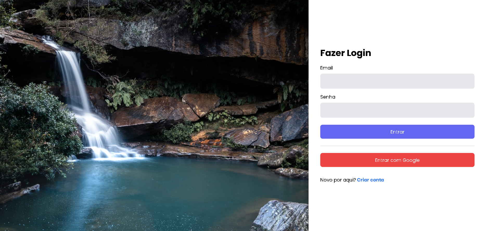

# Template Admin

Este é um template para construção de uma aplicação de administração.

- [Link do Projeto](https://moraiskaua-next-adminTemplate.vercel.app)

## Recursos

- Sistema de cadastro e login com email e senha
- Autenticação com o Google
- Integração com o Firebase
- Interface de usuário amigável
- Suporte a temas claro e escuro

## Tecnologias Utilizadas

- [Next.js](https://nextjs.org/): Um framework React para desenvolvimento web.
- [TypeScript](https://www.typescriptlang.org/): Uma linguagem de programação que adiciona tipagem estática ao JavaScript.
- [Axios](https://axios-http.com/): Biblioteca para fazer requisições HTTP.
- [Firebase](https://firebase.google.com/): Plataforma de desenvolvimento de aplicativos web e móveis.

## Imagens

